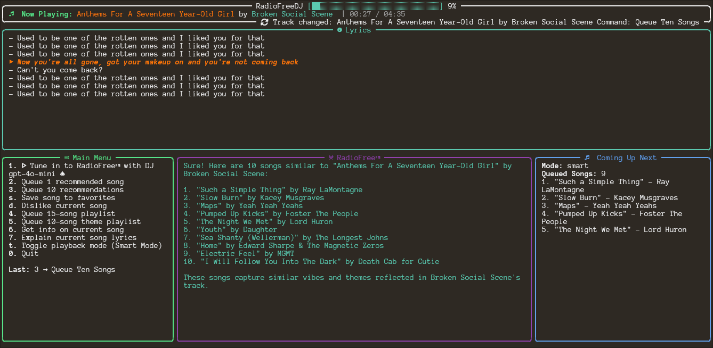

# RadioFreeGPT

**RadioFreeGPT** is a terminal-based graphical Spotify client powered by generative AI. It combines AI-driven prompts with Spotify integration to create a visually engaging and smart command-line radio DJ experience. Built using Python and rich CLI components, it turns your terminal into a dynamic radio control deck.

---



'''

Using `spotifyd` on Linux
-------------------------
On systems like Arch Linux you can run a headless Spotify client with
[`spotifyd`](https://github.com/Spotifyd/spotifyd). Start `spotifyd` before
running RadioFreeDJ so that the Spotify Web API has an active device to queue
tracks to.

Last.fm Integration
-------------------
To enable scrobbling, set these variables in your `.env` file:

```
LASTFM_API_KEY=your-lastfm-api-key
LASTFM_API_SECRET=your-lastfm-api-secret
LASTFM_SESSION_KEY=your-lastfm-session-key
```
The session key can be obtained by creating an API account on Last.fm and authenticating your user.
